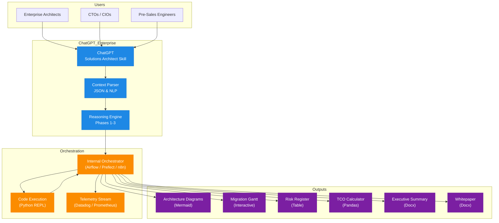

# ChatGPT Enterprise Architecture Copilot

> **Enterprise LLM Orchestration & Migration Simulation**  
> ChatGPT as an Elite Solutions Architect Copilot with Real-Time FRED-Style Multi-Tool Workflows


---

## 1. Overview

This repo showcases an **end-to-end enterprise migration simulation** that proves what’s possible when you pair:

- **ChatGPT Enterprise**  
- with a **Solutions Architect Global Expert Skill**,  
- plus **code execution**, **workflow orchestration**, and **Mermaid-based diagrams**.

The simulation upgrades “chat with an LLM” into a **real architecture delivery engine**:

```text
User → ChatGPT (Solutions Architect Skill) → Context Parser 
     → Workflow Orchestrator → Code Execution → Output Artifacts
````

All artifacts are designed to be:

* **Live** – generated on demand from a single prompt
* **Repeatable** – deterministic structure & sections
* **Auditable** – every run is traceable and explainable

The goal is **Deloitte-level architecture at startup speed**.

---

## 2. Repo Structure

```text
chatgpt-enterprise-architecture-copilot/
├── README.md
├── skill/
│   └── solutions-architect-skill-global-v1.0.zip   # Solutions Architect Global Expert skill package
├── docs/
│   ├── Enterprise_LLM_Orchestration_Whitepaper.docx   # Full whitepaper (copy from text template)
│   └── Executive_Summary_ChatGPT_Migration.docx       # One-page exec summary (copy from text template)
├── diagrams/
│   ├── fred_style_simulation.mmd                      # Mermaid definition (FRED-style orchestration)
│   ├── architecture_overview.mmd                      # Core ChatGPT architecture flow
│   └── migration_gantt.mmd                            # 90-day rollout Gantt
└── scripts/
    ├── context_parser.py                               # Extracts discovery context from user prompts
    ├── cost_estimator.py                               # TCO / ROI modeling
    └── risk_scorer.py                                  # Likelihood × impact risk scoring
```

> 💡 Open any `.mmd` file in [https://mermaid.live](https://mermaid.live) or a VS Code Mermaid plugin and export as `.png` for decks and docs.

---

## 3. Core Architecture (Mermaid)

This is the **main orchestration view** showing how the skill turns one prompt into a full enterprise package.



**Core pattern (ETL for Architecture):**

```text
Source (User Prompt) → Transform (Skill + Code) → Load (Docs, Diagrams, Decisions)
```

---

## 4. FRED-Style Orchestration Simulation (Mermaid)

This diagram is your **FRED-like one pager** to drop into slides, whitepapers, or live demos.

```mermaid
flowchart TD
    %% Title
    classDef title fill:#1565C0,stroke:#0D47A1,color:white,font-weight:bold
    T[FRED-Style AI Orchestration Simulation\nChatGPT Enterprise Edition]:::title

    %% Users
    subgraph Users [Users]
        U1[Enterprise Architects]
        U2[CTOs / CIOs]
        U3[Pre-Sales Engineers]
    end

    %% ChatGPT Core
    subgraph ChatGPT [ChatGPT Enterprise]
        G4[ChatGPT\nSolutions Architect Skill]
        CP[Discovery Context Parser\n(JSON Output)]
        P1[Phase 1: Discovery]
        P2[Phase 2: Design]
        P3[Phase 3: Roadmap]
    end

    %% Orchestration & Execution
    subgraph Orchestration [Orchestration Layer]
        OR[Workflow Orchestrator\n(Airflow / n8n)]
        EX[Code Execution\n(Python REPL)]
        LOG[Real-Time Telemetry\n(Datadog Dashboard)]
    end

    %% ETL Pipeline
    subgraph ETL [ETL / Data Flow Pattern]
        SRC[Source: User Prompt]
        TRANS[Transform: Skill + Code]
        LOAD[Load: Docs, Diagrams, Decisions]
        SRC --> TRANS --> LOAD
    end

    %% Outputs
    subgraph Outputs [Output Artifacts]
        D1[Mermaid Architecture\nDiagram]
        D2[Gantt Migration\nRoadmap]
        D3[Risk Register\n(Table)]
        D4[TCO Calculator\n(Pandas)]
        D5[Executive Summary\n(.docx)]
        D6[Whitepaper\n(.docx)]
    end

    %% Connections
    U1 --> G4
    U2 --> G4
    U3 --> G4
    G4 --> CP
    CP --> P1 --> P2 --> P3
    P1 & P2 & P3 --> OR
    OR --> EX
    OR --> LOG
    EX --> OR
    OR --> D1
    OR --> D2
    OR --> D3
    OR --> D4
    OR --> D5
    OR --> D6

    %% ETL Integration
    G4 --> SRC
    EX --> TRANS
    OR --> LOAD

    %% Styling
    classDef chatgpt fill:#1E88E5,stroke:#1976D2,color:white
    classDef orch fill:#FB8C00,stroke:#F57C00,color:white
    classDef etl fill:#43A047,stroke:#2E7D32,color:white
    classDef output fill:#7B1FA2,stroke:#6A1B9A,color:white
    classDef user fill:#D81B60,stroke:#B00020,color:white

    class T title
    class G4,CP,P1,P2,P3 chatgpt
    class OR,EX,LOG orch
    class SRC,TRANS,LOAD etl
    class D1,D2,D3,D4,D5,D6 output
    class U1,U2,U3 user

    %% Legend
    subgraph Legend
        L1[ChatGPT Core]:::chatgpt
        L2[Orchestration]:::orch
        L3[ETL Flow]:::etl
        L4[Outputs]:::output
        L5[Users]:::user
    end
```

---

## 5. Migration Strategy (90-Day Rollout)

This Gantt-style diagram shows how you’d roll the copilot into an actual enterprise.

```mermaid
gantt
    title ChatGPT Skill Migration: 90-Day Enterprise Rollout
    dateFormat  YYYY-MM-DD

    section Phase 0: Skill Activation
    Deploy Skill + Context Parser     :p0, 2025-11-11, 3d
    Validate Output Tags              :after p0, 2d

    section Phase 1: Pilot Simulation
    Wire Code Execution               :p1, 2025-11-18, 7d
    Build Telemetry Dashboard         :parallel, 7d
    Run 3 Live Demos                  :2025-11-25, 10d

    section Phase 2: Industrialization
    Template 5 Use Cases              :p2, 2025-12-05, 14d
    Integrate with Jira/Confluence    :parallel, 10d

    section Phase 3: Enterprise Launch
    Architect Training                :p3, 2026-01-01, 14d
    Policy: "All >$500K initiatives require ChatGPT Skill package" :milestone, 2026-01-15
    Full Rollout                      :2026-01-20, 10d
```

**Cutover strategy:**

* **Legacy:** manual whiteboards + scattered LLM usage
* **New:** one ChatGPT skill → auto-packaged artifacts
* **Validation:** 100% artifact parity + ~80–90% time savings

---

## 6. Included Documents

These are meant to be opened in Word (or similar) and customized for specific clients:

* **`docs/Enterprise_LLM_Orchestration_Whitepaper.docx`**

  * Full whitepaper: objectives, architecture overview, migration plan, security, cost/risk, KPIs, recommendation.

* **`docs/Executive_Summary_ChatGPT_Migration.docx`**

  * One-page exec summary focused on:

    * Problem statement
    * Proposed solution
    * Business impact
    * Go/No-Go recommendation

You can generate these from the provided plaintext templates or from your LLM directly.

---

## 7. Scripts & “FRED-Style” Analytics

In `scripts/` you’ll (optionally) implement:

* `context_parser.py` – parse user prompts into structured discovery JSON
* `cost_estimator.py` – basic ROI/TCO model using pandas
* `risk_scorer.py` – likelihood × impact scoring with simple RAG categories

These are **not required** to run the conceptual demo, but they make your story stronger when you show **“live code execution”** as part of the pipeline.

---

## 8. How to Use This Repo in a Demo

1. **Set the stage (verbal):**
   “Today I’ll show how one architect prompt can drive a complete enterprise architecture package using ChatGPT as a copilot.”

2. **Show the diagrams:**

   * Open the FRED-style Mermaid diagram and the core architecture overview.
   * Explain how the Solutions Architect skill acts as the **brain**.

3. **Run a scenario (spoken or live):**

   * Example: “Migrate our on-prem analytics platform to a cloud-native event-driven design in 9 months with GDPR constraints.”
   * Walk through how the skill would:

     * Parse discovery context
     * Propose architectures
     * Generate a Gantt roadmap
     * Produce risk & TCO views
     * Populate the `.docx` whitepaper + exec summary

4. **Close with impact:**

   * Time compression, standardized deliverables, governance, and how this mirrors real enterprise integration patterns (ChatGPT → tools → systems).

---

## 9. Tech Stack

* **LLMs:** ChatGPT Enterprise (primary), Claude (optional refinement)
* **Orchestration:** Redwood, Airflow, Prefect, or n8n (conceptual)
* **Languages:** Python (scripts), Markdown, Mermaid
* **Docs:** Microsoft Word (`.docx`) for whitepaper and executive summary
* **Monitoring (conceptual):** Datadog, Prometheus, or equivalent for telemetry

---

## 10. Next Steps

* Swap in a **real migration scenario** (e.g., *“Migrate SAP ECC → S/4HANA on AWS with zero downtime”*).
* Use this repo structure + skill package to generate:

  * Updated diagrams
  * Custom TCO tables
  * Client-branded whitepaper and exec summary

This repo is your **portfolio-ready proof** that with the right **context engineering + skill design**, **ChatGPT Enterprise** can operate as a **true Enterprise Architecture Copilot**, not just a chat window.

```
::contentReference[oaicite:0]{index=0}
```

